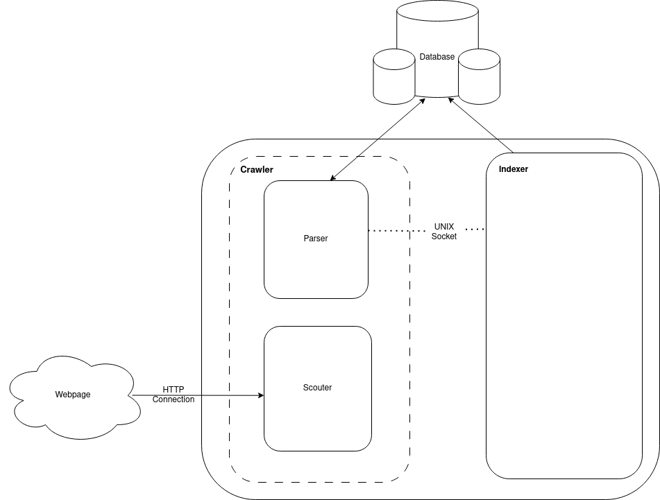

# Onecrawl RS

Rust implementation of a multi-threaded, multi-process web crawler built for a graduation thesis. The system splits crawling into two services: `onecrawl-scouter` downloads pages, while `onecrawl-parser` extracts structured content and stores it in MongoDB. Based on the thesis results in this repository, the redesigned crawler reported up to a 17x improvement over the earlier baseline crawler.



## Workspace

- `onecrawl-scouter`: fetches pages from the configured seed domains.
- `onecrawl-parser`: parses HTML, extracts links and page content, then writes to MongoDB.
- `onecrawl-util`: shared database and model utilities.
- `onequery`: simple MongoDB query playground.

## What it stores

The crawler persists:

- page metadata and text content
- outgoing links
- lists, tables, forms, images, styles, and scripts
- crawl session metadata

## How it works

1. `onecrawl-parser` starts first and listens on Unix domain sockets.
2. `onecrawl-scouter` downloads pages from `CRAWLER_START_URLS`.
3. HTML is sent to the parser process.
4. The parser extracts content and same-domain links, then pushes new URLs back to the crawler queue.

The traversal is a modified breadth-first search with a domain constraint, so each worker stays focused on the assigned seed domain.

## Run

Start MongoDB:

```bash
docker compose up -d crawler-mongodb
```

Build the workspace:

```bash
cargo build --release
```

Run the crawler and parser with the sample configuration from `run.sh`:

```bash
bash run.sh
```

Important environment variables:

- `CRAWLER_START_URLS`
- `CRAWLER_MAX_THREADS`
- `CRAWLER_DURATION_SECONDS`
- `PARSER_MAX_THREADS`
- `PARSER_DURATION_SECONDS`

## Thesis Documents

- Thesis PDF: [docs/skripsi/Skripsi-Muhammad Daffa Haryadi Putra.pdf](docs/skripsi/Skripsi-Muhammad%20Daffa%20Haryadi%20Putra.pdf)
- Journal PDF: [docs/journal/journal.pdf](docs/journal/journal.pdf)
- Typst journal source: [docs/journal/journal.typ](docs/journal/journal.typ)
- LaTeX thesis source: [docs/skripsi/latex_source/template-skripsi.tex](docs/skripsi/latex_source/template-skripsi.tex)

## Notes

This repository is the implementation artifact for the thesis, so `/docs` contains the supporting academic write-up, figures, and source files used in the final submission.
